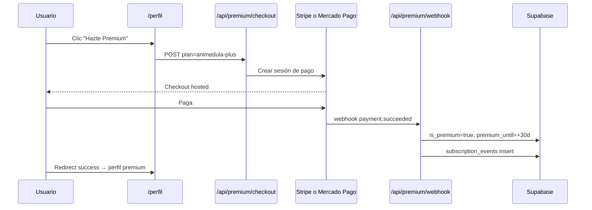
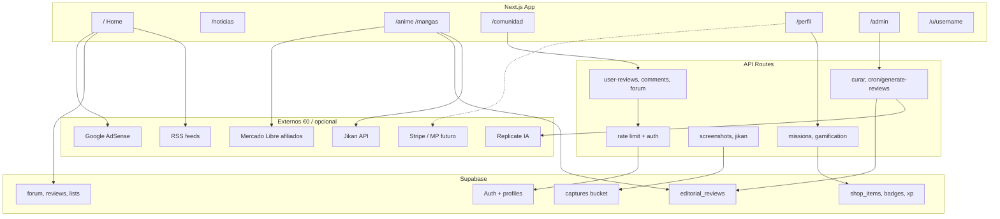
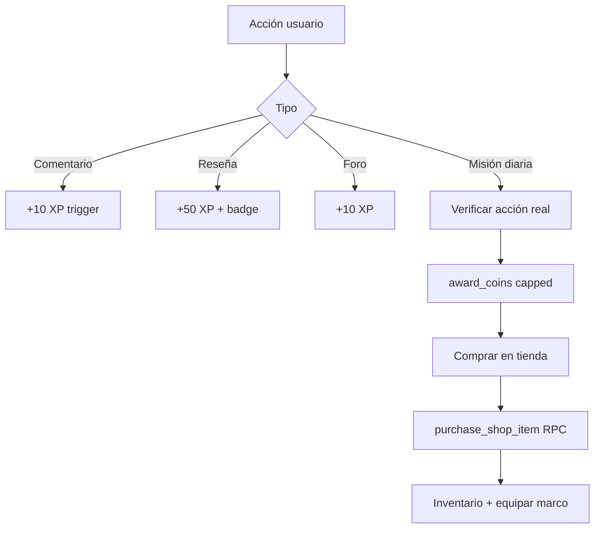

# Animédula — Guía de implementación y roadmap

Documento maestro: qué hacer tú, qué está hecho en código, y cómo encaja el proyecto.

---

## Checklist inmediato (haz esto primero)

### 1. Supabase — seguridad (obligatorio)

- [ ] Ejecutar [`supabase/schema-v8-security.sql`](../supabase/schema-v8-security.sql) en SQL Editor
- [ ] Verificar trigger `trg_protect_profile_privileged` en tabla `profiles`
- [ ] Probar que un usuario **no** puede cambiar `role`, `coins`, `xp`, `level` desde el cliente
- [ ] Ejecutar [`supabase/schema-v9-premium.sql`](../supabase/schema-v9-premium.sql) (campos premium + planes)

### 2. Vercel — variables de entorno

```env
# Seguridad
CRON_SECRET=                    # Secreto largo aleatorio
UPSTASH_REDIS_REST_URL=
UPSTASH_REDIS_REST_TOKEN=
REQUIRE_RATE_LIMIT=true         # En producción

# Supabase
NEXT_PUBLIC_SUPABASE_URL=
NEXT_PUBLIC_SUPABASE_PUBLISHABLE_KEY=
SUPABASE_SECRET_KEY=

# IA reseñas
REPLICATE_API_TOKEN=
REPLICATE_MODEL=meta/meta-llama-3-8b-instruct

# Afiliados (activa tienda)
MERCADOLIBRE_AFFILIATE_ID=

# Premium (cuando actives pagos)
STRIPE_SECRET_KEY=
STRIPE_WEBHOOK_SECRET=
NEXT_PUBLIC_STRIPE_PUBLISHABLE_KEY=
# o Mercado Pago:
MERCADOPAGO_ACCESS_TOKEN=
```

### 3. Supabase — manual

- [ ] Bucket Storage `captures` (público lectura, RLS escritura por usuario)
- [ ] Realtime foro: ejecutar `supabase/schema-v11-realtime-forum.sql` (ver abajo)
- [ ] Asignar admin: `update profiles set role = 'admin' where id = 'tu-uuid';`

#### Realtime del foro — qué es “activar Realtime”

No es un trigger, policy ni función nueva. Es **incluir las tablas en la publicación `supabase_realtime`** para que Supabase envíe eventos `postgres_changes` al navegador.

**Tablas:** sí, `public.forum_posts` y `public.post_reactions`.

**Qué escucha el cliente** (`components/ForumThread.tsx`):

| Tabla | Eventos | Uso |
|-------|---------|-----|
| `forum_posts` | `INSERT` | Hilos nuevos y respuestas (también son INSERT) |
| `post_reactions` | `INSERT`, `DELETE` (`event: '*'`) | Pulsar / quitar emoji |

**No** filtra por `content_type` ni por usuario en el canal: cuando alguien publica en cualquier parte del foro, tu vista recarga el hilo actual vía `/api/forum-posts`.

**Activar (SQL):**

```sql
-- Archivo completo: supabase/schema-v11-realtime-forum.sql
alter publication supabase_realtime add table public.forum_posts;
alter publication supabase_realtime add table public.post_reactions;
```

**O en el panel:** Database → **Publications** → `supabase_realtime` → marcar ambas tablas.

**RLS:** ya tienes `SELECT` público en ambas tablas; Realtime lo respeta. No hace falta DDL extra.

### 4. Cron reseñas

- [ ] `CRON_SECRET` en Vercel
- [ ] Cron en `vercel.json`: lunes 6:00 → `/api/cron/generate-reviews`
- [ ] Revisar borradores en `/admin` y publicar

### 5. Deploy

- [ ] Push a `main` → Vercel build OK
- [ ] Probar login, foro, reseñas, capturas, `/noticias`

---

## Estado actual del proyecto

| Área | Estado | Ruta / notas |
|------|--------|----------------|
| Home + feed híbrido | ✅ | `/`, RSS + comunidad |
| Anime / manga fichas | ✅ | `/anime/[slug]`, `/mangas/[id]` |
| Reseñas editoriales IA | ✅ | `lib/editorial/`, `/admin` |
| Reseñas UGC + votos | ✅ | `user_reviews`, `review_votes` |
| Foro + reacciones | ✅ | `/comunidad` |
| Gamificación XP/monedas | ✅ | Misiones, tienda cosmética |
| Capturas | ✅ | `/api/screenshots`, bucket `captures` |
| Noticias RSS + buscador | ✅ | `/noticias`, cards con imagen |
| Perfiles públicos | ✅ | `/u/[username]` |
| Tienda afiliados ML | ⏸️ | Oculta sin `MERCADOLIBRE_AFFILIATE_ID` |
| Premium de pago | 📋 | Schema v9 + UI; pagos pendiente Stripe/MP |
| Panel catálogo admin | ✅ | `/admin/catalogo` (vista + guía) |
| Perfil premium (admin) | ✅ | `/perfil` con layout premium si admin |

Leyenda: ✅ hecho · ⏸️ condicional · 📋 planificado en schema/docs

---

## Premium — cómo lo manejaremos

### Modelo de negocio (propuesta)

| Tier | Precio sugerido | Beneficios |
|------|-----------------|------------|
| **Gratis** | $0 | Foro, reseñas, XP, monedas, perfil público |
| **Animédula+** | ~$49–99 MXN/mes | Sin ads, marco avatar premium, badge exclusivo, prioridad en foro, cosméticos extra |
| **Fundador** | Manual / early adopters | Insignia `fundador`, título especial (ya en BD) |

### Dónde se guarda

| Dato | Tabla / campo |
|------|----------------|
| ¿Es premium? | `profiles.is_premium`, `profiles.premium_until` |
| Plan contratado | `profiles.premium_plan` → `subscription_plans.slug` |
| Historial pagos | `subscription_events` (schema v9) |
| Cosméticos comprables | `shop_items` (monedas) |
| Insignias ganadas | `badges` + `user_badges` |
| Marcos / bordes | `shop_items` tipo `avatar_border`, clase CSS en `css_class` |

### Flujo de inscripción (a implementar)



**Recomendación México:** Mercado Pago Subscriptions o Stripe (tarjetas internacionales). Ambos tienen webhooks; el código irá en `app/api/premium/`.

### Cómo probar premium hoy (sin pagos)

1. Asigna `role = 'admin'` en Supabase
2. Entra a `/perfil` → verás el **layout premium** (mismo que tendrán suscriptores)
3. En `/admin/catalogo` gestionas y documentas insignias, marcos y tienda

---

## Catálogo — dónde crear premios, insignias y marcos

### Insignias (`badges`)

**SQL (producción):**

```sql
insert into public.badges (slug, name, description, category, icon_url)
values ('cinefilo-oro', 'Cinefilo de Oro', '100 reseñas publicadas.', 'logro', '');
```

**Desbloqueo automático:** triggers en `schema-v3-phase2.sql` (ej. `primera-resena`). Nuevas insignias = nueva función trigger o lógica en API.

**Vista admin:** `/admin/catalogo` → sección Insignias

### Marcos y cosméticos (`shop_items`)

```sql
insert into public.shop_items (slug, name, description, price_coins, item_type, css_class)
values (
  'border-legendario',
  'Marco Legendario',
  'Borde dorado animado para avatar.',
  150,
  'avatar_border',
  'cosmetic-border-legendary'
);
```

**CSS:** añadir clase en `app/globals.css` (ej. `.cosmetic-border-legendary`).

**Vista admin:** `/admin/catalogo` → Tienda cosmética

### Títulos por nivel (`selectable_titles`)

```sql
insert into public.selectable_titles (slug, name, min_level)
values ('sensei-anime', 'Sensei del Anime', 20);
```

### Premios de pago real (Premium)

No van en `shop_items` con monedas; se desbloquean vía:

- `profiles.is_premium = true`, o
- `user_badges` al activar suscripción en webhook

---

## Diagrama general del proyecto



---

## Flujo de contenido editorial

```mermaid
flowchart LR
  A[Vista ficha anime/manga] --> B{¿Publicada en BD?}
  B -->|Sí| C[Mostrar reseña]
  B -->|No| D{¿Cache JSON?}
  D -->|Sí| C
  D -->|No| E[Replicate IA]
  E --> F[Cache + borrador pending]
  F --> G[/admin moderación]
  G -->|Aprobar| H[status published]
  H --> C
```

---

## Flujo gamificación



---

## Seguridad — capas activas

| Capa | Qué hace |
|------|----------|
| Middleware | Refresh sesión Supabase |
| RLS | Tablas por usuario / editor |
| Trigger profiles | Bloquea role/coins/xp/level |
| RPC award_* | Solo propio usuario, montos máximos |
| Rate limit | Upstash en mutaciones y proxies |
| CSP + headers | `next.config.ts` |
| Cron secret | IA batch protegido |
| Redirect safe | Login y afiliados ML |

---

## Roadmap sugerido (orden)

1. **Ahora:** checklist seguridad + deploy + admin role
2. **Semana 1:** Stripe o Mercado Pago checkout + webhook premium
3. **Semana 2:** Más insignias automáticas + marcos CSS premium
4. **Semana 3:** Quitar ads para `is_premium`, badge en foro
5. **Mes 2:** Panel admin CRUD (subir iconos insignias a Storage)
6. **Continuo:** Agente reseñas cron + moderación `/admin`

---

## Archivos clave

| Tema | Archivo |
|------|---------|
| Seguridad SQL | `supabase/schema-v8-security.sql` |
| Premium SQL | `supabase/schema-v9-premium.sql` |
| Calendario SQL | `supabase/schema-v10-editorial-calendar.sql` |
| **Cron y calendario** | **`docs/CRON-Y-CALENDARIO.md`** |
| Migración completa | `supabase/schema-migrate-run-all.sql` |
| Agente reseñas | `.cursor/skills/review-agent/SKILL.md` |
| Copy UI | `lib/copy.ts` |
| Premium helper | `lib/premium.ts` |
| Perfil premium UI | `components/PremiumProfileLayout.tsx` |
| Admin catálogo | `app/admin/catalogo/page.tsx` |

---

## Contacto y legal

- Avisos afiliados: `components/AffiliateDisclosure.tsx`
- Privacidad / términos: `/privacidad`, `/terminos`
- Email contacto: `NEXT_PUBLIC_CONTACT_EMAIL`

*Última actualización: junio 2026*
